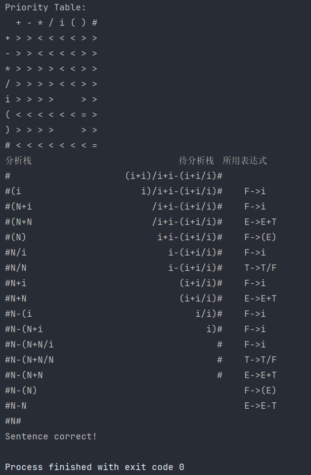

# 郑州大学2023-2024学年第一学期编译原理实验

本仓库实现了实验的全部要求，本实验包括 4 部分：
1. 源程序的预处理及词法分析程序的设计与实现
2. 预测分析算法的设计与实现
3. 算符优先分析算法的设计与实现
4. LR分析方法的设计与实现

## 使用方法

### 方法1：直接使用

1. 下载本仓库到本地
2. 每个实验都对应有一个 `ex` 包，比如*实验1*对应 `ex1` 包
3. 进入对应实验的 `ex` 包，运行 `Main#main` 方法即可

### 方法2：API式使用

从 [Release](https://github.com/APeng215/Compilation-Principle-Experiment/releases/latest) 中下载 Jar 文件，[导入](https://www.baidu.com/s?ie=UTF-8&wd=%E5%A6%82%E4%BD%95%E5%AF%BC%E5%85%A5jar%E6%96%87%E4%BB%B6%EF%BC%9F)至自己的项目中使用即可

## 画廊

